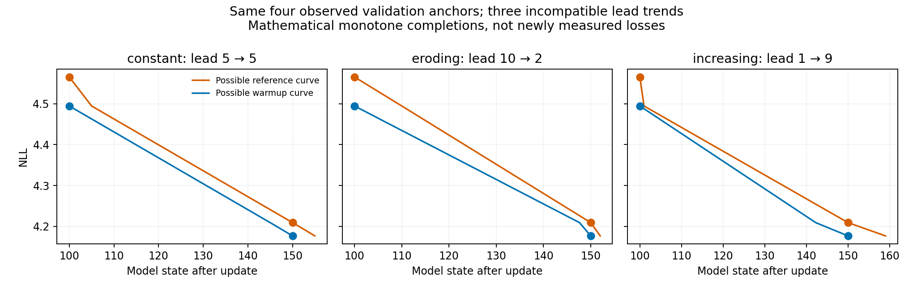
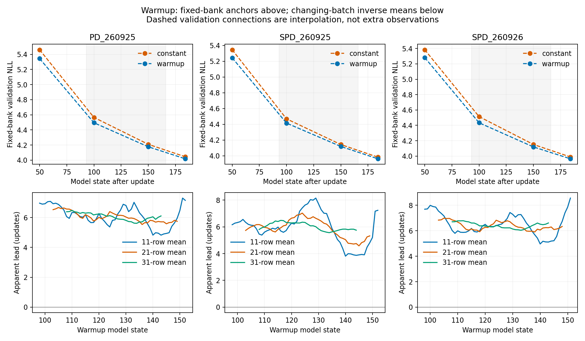

# Warmup keeps an advantage; its precise progress-lead trend is unresolved

2026-09-28. Retrospective analysis of all three completed 184-update, 16M-token
warmup versus constant-beta-.9 pairs. CPU scalar reduction only, 1.77 seconds;
1,283 consumed files hash-checked before/after, including 150 frozen source
files. No model, tensor, optimizer, new evaluation, training or GPU call.
Read [PROTOCOL.md](PROTOCOL.md), [design review](DESIGN_REVIEW.md),
[source/clock review](SOURCE_CLOCK_REVIEW.md), and
[main coverage review](MAIN_COVERAGE_REVIEW.md). Full numerical output is
[result.json](result.json); tables and figures are linked below.

**Finding:** the denser training curves consistently retain a positive apparent
lead of several updates after beta matches. Their estimated erosion depends
strongly on smoothing. The fixed-bank validation cadence cannot independently
distinguish a constant head start from catch-up or increasing lead. Explicit
monotone curves with all three behaviors exactly reproduce its four relevant
anchors. The original endpoint gains remain established. No precise continuing
rate or exact constant-shift claim follows.

## What is compared

PD seed260925 on L40S; SOAP-PD seeds260925 and260926 on Ada. Each warmup arm
has its own constant-.9 reference. All six have the same16M batch and doubled
3,079,741,440-token horizon. The within-pair sources are identical for the two
new replication pairs. The original SOAP reference uses an older revision with
reviewed inactive defaults; it is qualified as an active-recipe comparison,
not byte-identical training across source revisions.

All paired initial hashes, train/validation manifests, hardware, precision,
per-step exposure and LR clocks pass. Momentum reaches.9 at update93; LR first
declines at167. Training record t measures W[t−1] on incoming batch t, while
validation t measures W[t]. Secondary smoothing uses only records94..166,
or states93..165, with complete windows and full batches. Only the last update,
184, has a shortened batch and it is excluded from those summaries.

The final validation differences, warmup minus control, remain:

| Pair | Difference at184 |
|---|---:|
| PD260925 | −.026671 |
| SOAP-PD260925 | −.021193 |
| SOAP-PD260926 | −.023944 |

These are two SOAP seeds and one PD seed, not a fully crossed two-method,
two-seed replication. Lower loss at fixed exposure is the directly observed
result; the following horizontal descriptions do not replace it.

## Fixed-bank secants suggest erosion, but do not resolve it

Only validation100 and150 lie inside the common-beta, constant-LR interval.
For each predeclared level4.25/4.30/4.35/4.40, both runs bracket it there.
Lead is control crossing minus warmup crossing; positive means warmup earlier.

| Pair | Secant lead at NLL4.40 | Secant lead at NLL4.25 | Change as loss falls |
|---|---:|---:|---:|
| PD260925 | 8.347 | 5.803 | −2.544 |
| SOAP-PD260925 | 8.033 | 5.742 | −2.291 |
| SOAP-PD260926 | 10.375 | 7.204 | −3.170 |

All four target readouts reuse the same two observations per run. Their lead
is mechanically affine in the chosen loss level under linear interpolation;
four targets are not four trajectory measurements. Monotonicity alone puts
each crossing in[100,150], hence the paired lead in[−50,+50]. This is a
conditional bracket, not a confidence interval or a claim about an unseen
first passage. The endpoint reference never records loss as low as its own
warmup endpoint; no time-to-match beyond184 is extrapolated.

The fixed omission controls materially change the values:

| Pair | At4.40: original / omit100 / omit150 | At4.25: original / omit100 / omit150 |
|---|---|---|
| PD260925 | 8.35 / 3.88 / 10.02 | 5.80 / 3.02 / 7.77 |
| SOAP-PD260925 | 8.03 / 3.64 / 9.13 | 5.74 / 2.78 / 7.26 |
| SOAP-PD260926 | 10.37 / 3.98 / 12.21 | 7.20 / 3.25 / 9.32 |

Reconstructing each recorded100 score from50/150 misses its inverse time by
20.6–23.7 updates across the six arms; reconstructing150 from100/184 misses
by5.0–8.0. Common error partly cancels within a pair, but the paired inverse
errors still range−2.37..−.75 updates at100 and+1.40..+1.66 at150.
The controls cross changing-beta or cooldown phases. They show sensitivity,
not a calibrated error distribution or bound on the interior interpolation.

## Three contradictory lead trends fit exactly

For each pair, the measured anchors satisfy R100>W100>R150>W150. Set a
possible reference curve through

    (100,R100), (100+delta100,W100), (150,R150), (150+delta150,W150),

and define a possible warmup curve by L_W(t)=L_R(t+delta(t)) on100..150.
The three fixed choices are delta=5; delta decreasing10→2; and delta
increasing1→9. Their time maps are strictly increasing, all their loss curves
are strictly decreasing, and the reference knots never exceed159. All reproduce
the four original anchors exactly. Their inverse-lead identities agree to
<2e−13 updates. This holds in every pair.

These are mathematical completions of missing fixed-bank observations, not
new model losses, plausible-dynamics certificates, or fits to the training
losses. The piecewise-linear corners are not required physical behavior;
monotonicity by itself does not prohibit them. Additional smoothness/dynamics
assumptions would be additional evidence requirements. They prove that these
four anchors do not identify even the sign of the lead's change.

## Dense training records support a retained several-update advantage

At the predeclared warmup-state anchors110/120/130/140, all36 reference
crossings are uniquely bracketed inside their complete valid smoothing support.
All are positive. The18 smoothed curves (six runs times three widths) are
strictly decreasing over their eligible ranges; this is an observed feature,
not a forced monotonic fit.

| Pair |11-row mean: lead110→140 |21-row mean: lead110→140 |31-row mean: lead110→140 |
|---|---|---|---|
| PD260925 |6.34→4.82 |6.48→5.78 |6.48→6.05 |
| SOAP-PD260925 |5.60→3.81 |5.96→5.04 |5.99→5.83 |
| SOAP-PD260926 |5.99→4.96 |6.68→6.06 |6.78→6.52 |

The selected endpoint contrast shows apparent erosion in all9 cases, but its
size ranges from.16 to1.79 updates. Intermediate anchors and full curves
show rises and falls; the curves are not monotone lead trajectories. With the
widest mean, changes are only.16–.43 updates and apparent leads remain near6.
That is compatible with an approximately retained head start, without an
equivalence claim. The narrower means show substantially larger local changes.

Complete valid center ranges are states98..160,103..155 and108..150 for
widths11/21/31. The full inverse curves contain no ambiguous crossings; at
6–9 late centers per pair/width, the reference has no bracket inside its
permitted range. All such entries are retained as below-observed-range,
with no extrapolation or replacement by zero. The plotted lines stop there.

These training losses score different batches at different times. Vertical
same-step differences share batch difficulty, while a horizontal match compares
different corpus offsets. Smoothing cannot eliminate a broad difficulty trend,
and all three pairs share the stream. Agreement across seeds therefore does
not independently remove that nuisance. Shared beta/LR also leaves different
weights, radii, histories and adaptive statistics. Neither these curves nor
the secant curves establish equal optimizer states or a causal time clock.

## Decision and artifacts

The useful positive observation is persistence of a substantial advantage after
the momentum coefficients match. The archive does not resolve a precise
constant head start versus genuine catch-up in fixed-bank loss. Main's
4–7-update description is broadly consistent with the changing-batch curves,
but should remain a descriptive range rather than a demonstrated rate law.
Conversely the shrinking vertical gap is insufficient grounds to declare the
early progress lost. Close this scalar route without more smoothing choices,
time warps, fresh scores or training. Keep the practical endpoint result and
turn attention to interventions that distinguish geometry mechanisms.

- [All validation secants and omission controls](validation_leads.csv)
- [All36 fixed training anchors](training_anchors.csv)
- [All supported training means and censored crossings](smoothed_training.csv)
- [Complete raw paired training scalars](raw_training.csv)
- [Full result, crossing sets, qualification and source hashes](result.json)
- [Independent result review](RESULTS_REVIEW.md)

The original protocol, fixed readout, earlier endpoint extracts and source
archives are preserved. Main code, main notes and scheduler state are unchanged.
