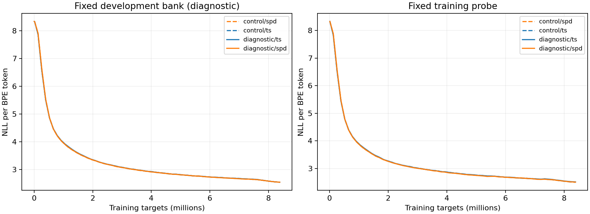

# Input covariance clock diagnostic

Development evidence only; both failed candidate verdicts remain unchanged.

| Method | Original C | Reference-derived clock | Change |
|---|---:|---:|---:|
| ts | 2.531675721 | 2.531164495 | -0.000511226 |
| spd | 2.532338563 | 2.531930004 | -0.000408559 |

Change in SOAP-PD minus TS: **+0.000102667** (negative favors SOAP-PD).

Close the input-clock hypothesis at this setting; no nearby EMA sweep.

Both the relative gain and SOAP-PD's absolute gain must reach0.005 NLL to pass the declared diagnostic gate.

All1,018,977 development targets from4,957 documents enter the endpoint. Saved windows and documents reproduce each mean; initialization, stream, hardware, population and numerical-source matching are checked.

See results.json for every fixed document group and artifact hashes. No sealed test was scored.

The complete saved trajectories are in [trajectories.json](trajectories.json). The plotted development curve uses the fixed bank; the decision above uses the full endpoint population. No checkpoint is selected from these curves.

