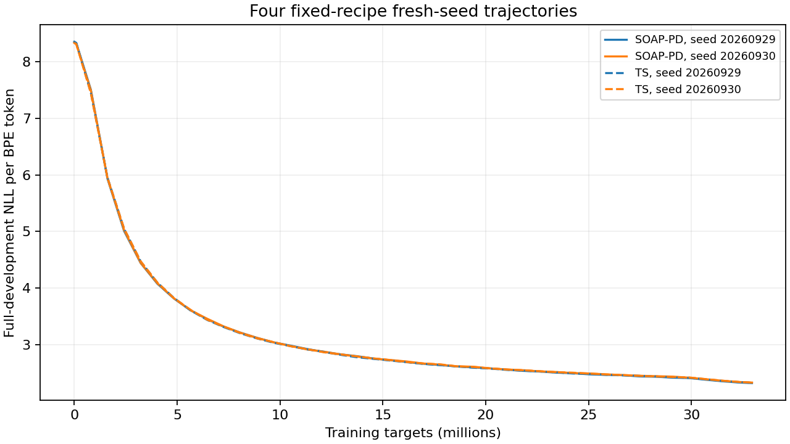
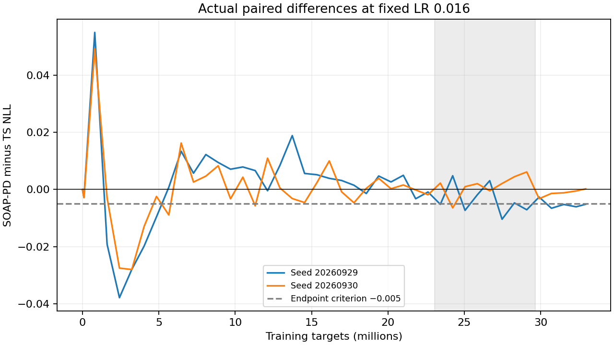

# Fixed-recipe fresh-seed replication

The fixed-recipe lead does not meet replication: close this comparison without adding seeds or repairing the recipe.

All results are development evidence. The original scale diagnostic remains failed; surrogate qualification remains false.

| Fresh seed | TS NLL | SOAP-PD NLL | SOAP-PD minus TS | At most −0.005 |
|---:|---:|---:|---:|:---:|
| 20260929 | 2.32620144 | 2.32103037 | -0.00517107 | True |
| 20260930 | 2.33003106 | 2.33025013 | +0.00021907 | False |

Fresh-pair mean: -0.00247600; observed range: -0.00517107 to +0.00021907.
Original selection seed 20260928: -0.01136329, excluded from the primary estimate.

| Late step | Seed 20260929 gap | Seed 20260930 gap |
|---:|---:|---:|
| 232 | -0.00519842 | +0.00225422 |
| 240 | +0.00481697 | -0.00644245 |
| 248 | -0.00731667 | +0.00099314 |
| 256 | -0.00183441 | +0.00204558 |
| 264 | +0.00308419 | -0.00046782 |
| 272 | -0.01042246 | +0.00210067 |
| 280 | -0.00469295 | +0.00447195 |
| 288 | -0.00710218 | +0.00614980 |

| Fixed document group | Seed 20260929 gap | Seed 20260930 gap |
|---:|---:|---:|
| 0 | -0.00545813 | +0.00032543 |
| 1 | -0.00577514 | -0.00010823 |
| 2 | -0.00292071 | +0.00002216 |
| 3 | -0.00648538 | +0.00062666 |

Groups use the first byte of normalized document SHA-256 modulo four. Late steps and groups are descriptive; no additional pass criteria are applied.

All 43 evaluations use every 1,018,977 target from 4,957 development documents. Saved window and document losses reconstruct each endpoint. Plan/config/source hashes, raw stream hashes, nonrecycling, eligible matched hardware, and seed pairing were checked.

The dashed −0.005 line is the endpoint replication criterion; it is not a new trajectory gate.

Development documents were used in recipe selection; fresh seeds are not independent test confirmation.
The selected original seed is context only and excluded from every primary aggregate.
Late trajectories and all four fixed document groups are reported descriptively, without new gates or LR envelopes.
This comparison does not establish five-method ordering, batch/momentum effects, horizon robustness, or a qualified surrogate.
Both independent confirmation populations remain unscored; no test artifact is loaded by this readout.
