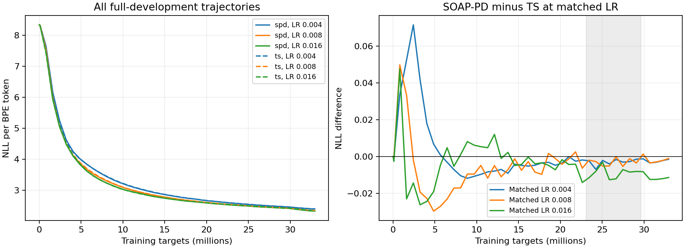

# Exposure-and-batch diagnostic

Diagnostic does not pass; no edge expansion or followup optimizer/architecture sweep under this diagnostic.

Development evidence only. The two original failed candidate verdicts remain unchanged.

| LR | TS full NLL | SOAP-PD full NLL | SOAP-PD minus TS |
|---:|---:|---:|---:|
| 0.004 | 2.39865482 | 2.39719634 | -0.00145848 |
| 0.008 | 2.34388528 | 2.34284395 | -0.00104133 |
| 0.016 | 2.33847782 | 2.32711453 | -0.01136329 |

| Predeclared gate | Pass |
|---|---|
| absolute_progress_both | True |
| two_material_matched_lrs | False |
| both_minima_interior | False |
| material_endpoint | True |
| every_document_group_favors_spd | True |
| late_direction_consistent | True |
| late_median_material | True |

Endpoint LR-envelope gap: -0.01136329. Absolute changes versus original C: {'ts': -0.19319789976013935, 'spd': -0.20522403189345706}.

The final update uses an underfilled batch of 16512 targets (129 contexts); the first326 updates use100992 targets each.

Selected-recipe document-group differences: {0: -0.010689034675523068, 1: -0.012380272196458986, 2: -0.011308657798904775, 3: -0.011086047753772643}.

Fixed late-step LR-envelope differences: {232: -0.011462676861651477, 240: -0.00800983704844338, 248: -0.005075387607772264, 256: -0.012436929584910938, 264: -0.008886688353906269, 272: -0.007052939434853744, 280: -0.008421289779024121, 288: -0.008076145412466929}.

Every curve and endpoint includes all1,018,977 real development targets. Saved window/document means, source hashes, stream prefixes and pairing were verified. Complete raw trajectories and every gate are retained in results.json.

One development seed and an adaptively selected regime, not independent confirmation.
Joint batch and exposure change cannot identify their separate effects.
LR envelopes switch recipes and are not realizable training trajectories or speedups.
Current fresh-data capacity cannot provide a doubled horizon from this base.
Five-method, batch, momentum, and sealed confirmation gates remain unsatisfied.
