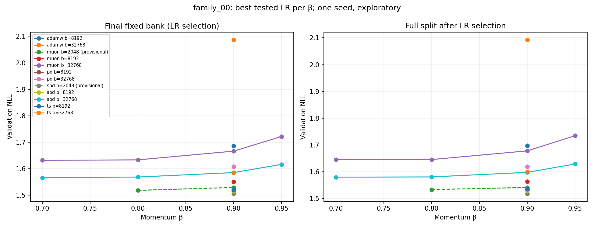
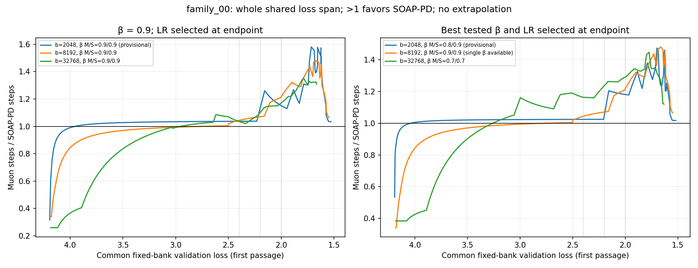

# Tiny surrogate: batch and momentum evidence

All 63 unique configured runs are retained: {"complete":50,"initializing":1,"missing":11,"running":1}. Saved artifact statuses are a snapshot, not a live scheduler check.

Exploratory discovery only. No seed pooling: different seeds, architectures, budgets, and other recipe choices form separate families. Observation cadence (eval_every) may differ and is retained per run; it is not a training recipe change in this dropout-free runner. Every LR is selected by final fixed-bank validation NLL; full-split results are shown afterward. Failed, unfinished, inconsistent, or provenance-mismatched runs are ineligible. An unfinished/failed LR grid leaves its winner provisional. Best tested momentum also uses final fixed-bank NLL and is separately labeled; this is not independent confirmation.

| Family | Method | Batch | β | Selected LR | Bank NLL | Full NLL | Grid / bracket |
|---|---|---:|---:|---:|---:|---:|---|
| family_00 | muon | 2048 | 0.7 | — | — | — | no eligible candidate |
| family_00 | muon | 2048 | 0.8 | 0.016 | 1.518444 | 1.533638 | provisional; unbracketed |
| family_00 | muon | 2048 | 0.9 | 0.032 | 1.529471 | 1.541551 | provisional; unbracketed |
| family_00 | muon | 2048 | 0.95 | — | — | — | no eligible candidate |
| family_00 | spd | 2048 | 0.7 | — | — | — | no eligible candidate |
| family_00 | spd | 2048 | 0.8 | — | — | — | no eligible candidate |
| family_00 | spd | 2048 | 0.9 | 0.016 | 1.505739 | 1.518119 | provisional; unbracketed |
| family_00 | spd | 2048 | 0.95 | — | — | — | no eligible candidate |
| family_00 | adamw | 32768 | 0.9 | 0.002 | 2.086414 | 2.092378 | complete; unbracketed |
| family_00 | muon | 32768 | 0.7 | 0.064 | 1.631726 | 1.645730 | complete; unbracketed |
| family_00 | muon | 32768 | 0.8 | 0.064 | 1.633602 | 1.645751 | complete; unbracketed |
| family_00 | muon | 32768 | 0.9 | 0.064 | 1.666530 | 1.678102 | complete; unbracketed |
| family_00 | muon | 32768 | 0.95 | 0.032 | 1.721941 | 1.734789 | complete; unbracketed |
| family_00 | pd | 32768 | 0.9 | 0.032 | 1.607611 | 1.619577 | complete; unbracketed |
| family_00 | spd | 32768 | 0.7 | 0.032 | 1.565955 | 1.579976 | complete; unbracketed |
| family_00 | spd | 32768 | 0.8 | 0.016 | 1.568801 | 1.580879 | complete; unbracketed |
| family_00 | spd | 32768 | 0.9 | 0.016 | 1.585567 | 1.597871 | complete; unbracketed |
| family_00 | spd | 32768 | 0.95 | 0.016 | 1.616628 | 1.629351 | complete; unbracketed |
| family_00 | ts | 32768 | 0.9 | 0.016 | 1.585252 | 1.598778 | complete; interior |
| family_00 | adamw | 8192 | 0.9 | 0.004 | 1.686029 | 1.697770 | complete; interior |
| family_00 | muon | 8192 | 0.9 | 0.032 | 1.551057 | 1.563979 | complete; interior |
| family_00 | pd | 8192 | 0.9 | 0.016 | 1.521111 | 1.532625 | complete; interior |
| family_00 | spd | 8192 | 0.9 | 0.016 | 1.514761 | 1.529338 | complete; interior |
| family_00 | ts | 8192 | 0.9 | 0.016 | 1.519500 | 1.535761 | complete; interior |

## Fixed common thresholds

The original thresholds 2.4, 2.2, and 2.0 remain in this table and `thresholds.csv`, including censoring. Ratios are Muon steps / SOAP-PD steps (>1 favors SOAP-PD); `ratios.json` also stores the reciprocal. Curves show the whole shared observed loss span, including all evaluation loss knots and a 201-point grid. No extrapolation, best-threshold selection, or monotonic smoothing is used. Sparse-evaluation interpolation and first crossings are descriptive. Endpoint-tuned recipes are not reselected per threshold.

| Family | Selection | Batch | β Muon / SOAP-PD | Full NLL Δ SOAP-PD−Muon | Loss 2.4 | Loss 2.2 | Loss 2.0 |
|---|---|---:|---|---:|---:|---:|---:|
| family_00 | best_tested_momentum (provisional) | 2048 | 0.8 / 0.9 | -0.015519 | 1.0243 | 1.0480 | 1.1812 |
| family_00 | best_tested_momentum (single β available) | 8192 | 0.9 / 0.9 | -0.034640 | 1.0437 | 1.0706 | 1.2171 |
| family_00 | best_tested_momentum | 32768 | 0.7 / 0.7 | -0.065755 | 1.1633 | 1.2364 | 1.2914 |
| family_00 | fixed_momentum_0.9 (provisional) | 2048 | 0.9 / 0.9 | -0.023432 | 1.0370 | 1.1336 | 1.1511 |
| family_00 | fixed_momentum_0.9 | 8192 | 0.9 / 0.9 | -0.034640 | 1.0437 | 1.0706 | 1.2171 |
| family_00 | fixed_momentum_0.9 | 32768 | 0.9 / 0.9 | -0.080231 | 1.0359 | 1.1019 | 1.1719 |

`runs.json` preserves every config origin, resolved run path, metadata, file hashes, frozen execution source hashes, issues, and validation curve. `selection.json` preserves every candidate and boundary/incomplete flags. `pairing.json` records the hash vetoes. Different family plots cannot be read as controlled batch comparisons. More favorable single-seed endpoints do not qualify the surrogate.

