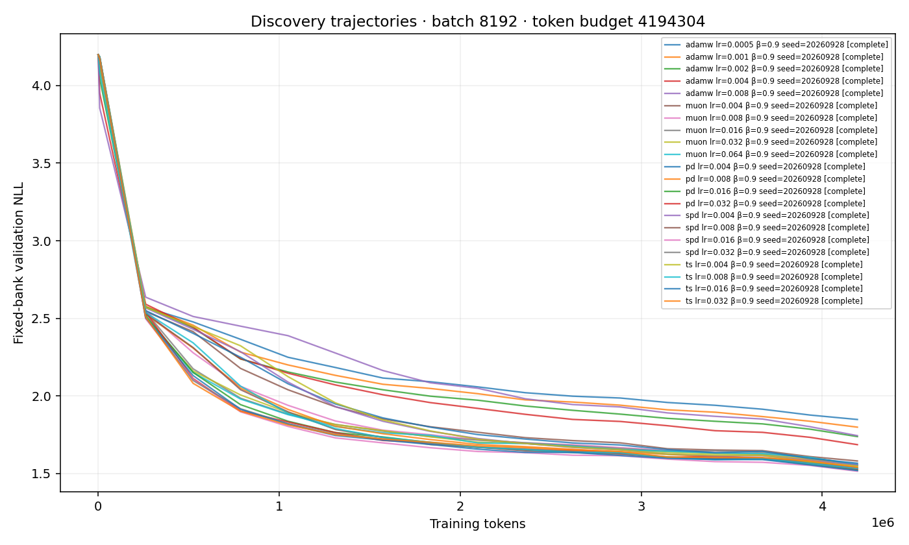
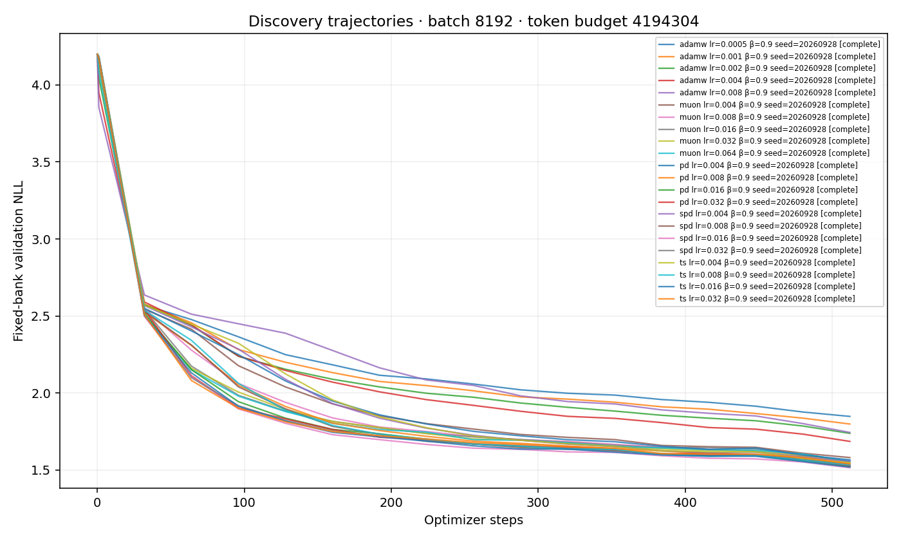
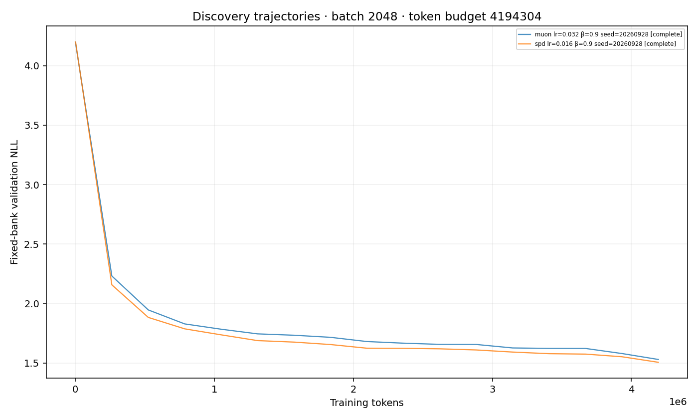
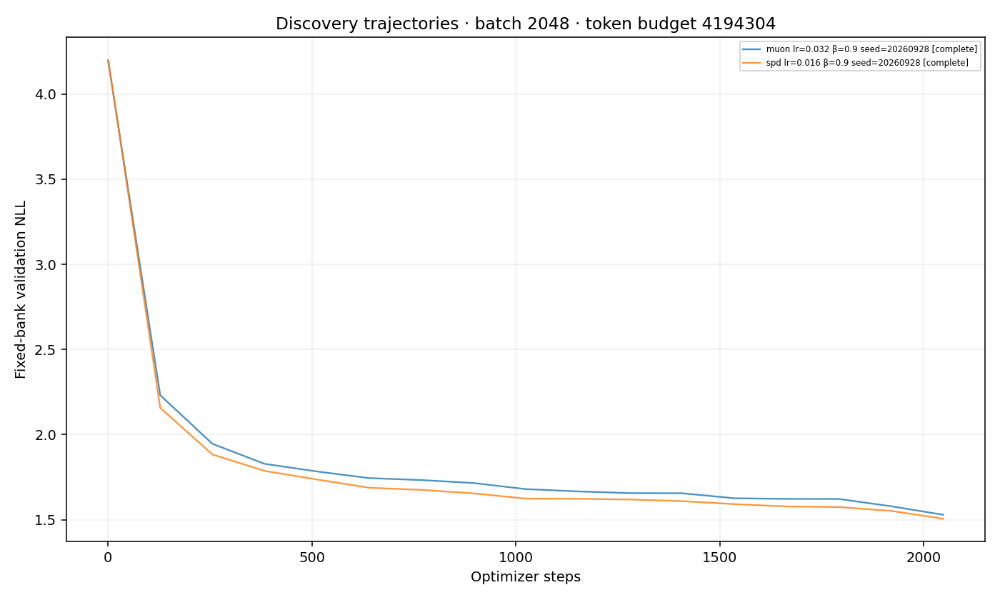
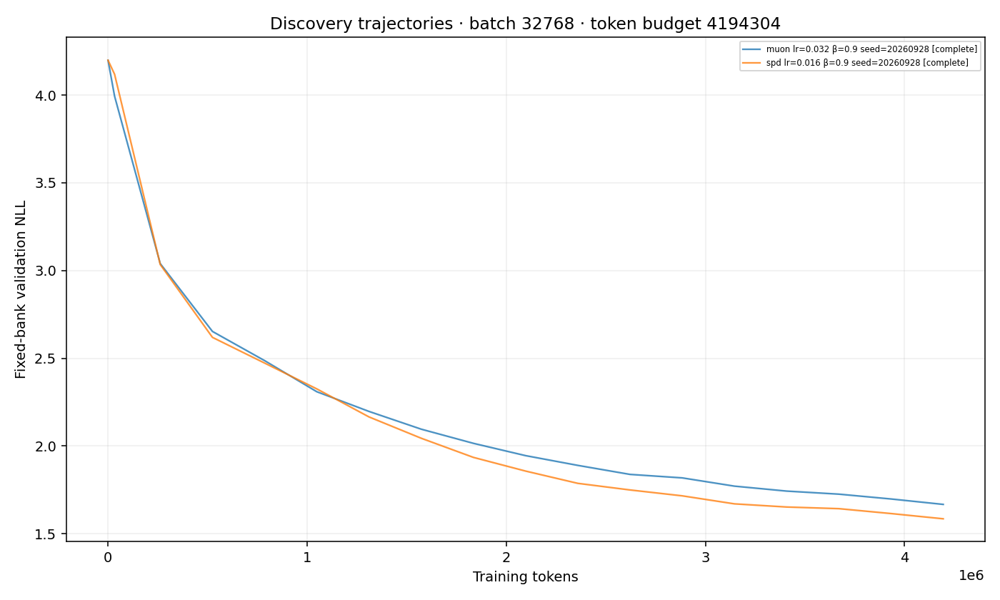
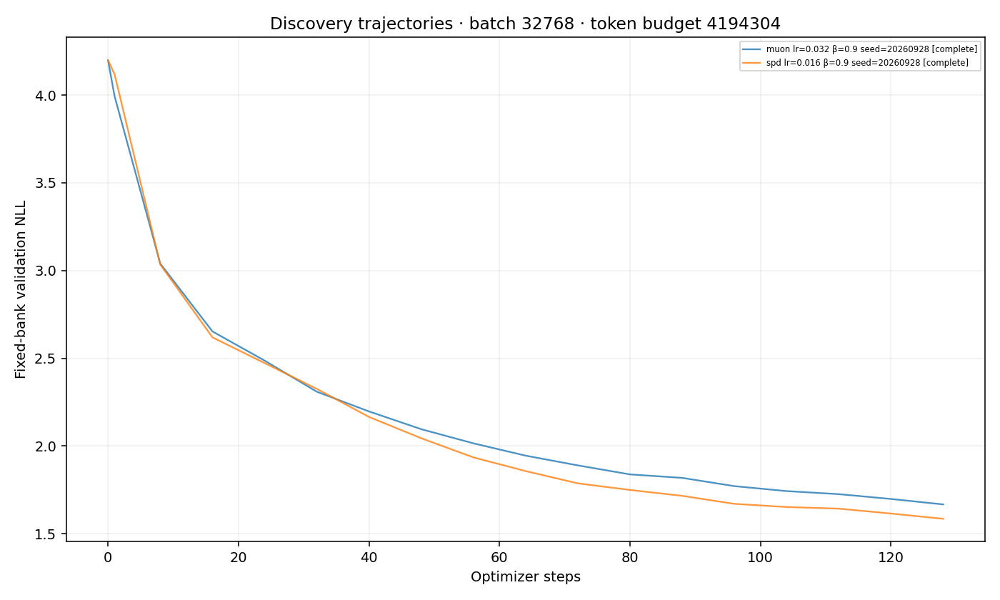

# Tiny surrogate discovery report

Exploratory candidate screening only. Optimizer ordering, batch effects, and momentum optima require fresh-seed confirmation; this report makes no statistical ranking claim.

Accounted for all 26 configured runs: complete=26.
Status is the saved artifact status, not a live scheduler/process check.

Selection uses the mean endpoint fixed validation bank, with the same planned seeds per learning rate. Full-split validation is displayed only after selection. Incomplete grids remain provisional.

| Method | Batch | Momentum | α | Selected LR | Fixed-bank NLL | Full NLL | Seeds | Bracket |
|---|---:|---:|---:|---:|---:|---:|---:|---|
| adamw | 8192 | 0.9 | 0.25 | 0.004 | 1.686029 | 1.697770357131958 | 1 | interior |
| muon | 2048 | 0.9 | 0.25 | 0.032 | 1.529471 | 1.5415512323379517 | 1 | unqualified |
| muon | 32768 | 0.9 | 0.25 | 0.032 | 1.667594 | 1.6833958625793457 | 1 | unqualified |
| muon | 8192 | 0.9 | 0.25 | 0.032 | 1.551057 | 1.5639785528182983 | 1 | interior |
| pd | 8192 | 0.9 | 0.25 | 0.016 | 1.521111 | 1.5326248407363892 | 1 | interior |
| spd | 2048 | 0.9 | 0.25 | 0.016 | 1.505739 | 1.5181188583374023 | 1 | unqualified |
| spd | 32768 | 0.9 | 0.25 | 0.016 | 1.585567 | 1.597870945930481 | 1 | unqualified |
| spd | 8192 | 0.9 | 0.25 | 0.016 | 1.514761 | 1.5293382406234741 | 1 | interior |
| ts | 8192 | 0.9 | 0.25 | 0.016 | 1.519500 | 1.5357614755630493 | 1 | interior |

See `selection.json` for complete recipes, all candidate scores, and selected run IDs; `runs.csv` includes every configured status and issue.

The pre-cooldown value is the final evaluation at or before the configured cooldown start (90% by default). An overfit sign means validation worsened from that point while the fixed training probe improved; it is a descriptive flag, not a significance test.

Overfit signs: none observed in available paired probe points.

Pairing audit: 0 groups with mismatched hashes; 0 groups with missing hashes. Details and missing run IDs are in `pairing.json`. Hash matching checks initial weights, the training-window stream, the fixed validation bank, corpus bytes, and split manifests within seed/budget/architecture groups.

Requested common-threshold crossings are in `thresholds.csv`; interpolation is exploratory, and missing crossings are censored rather than extrapolated.

