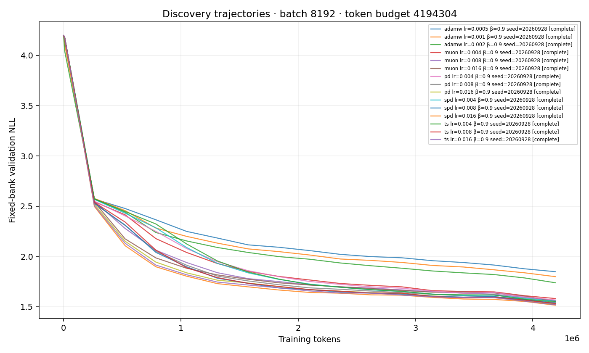
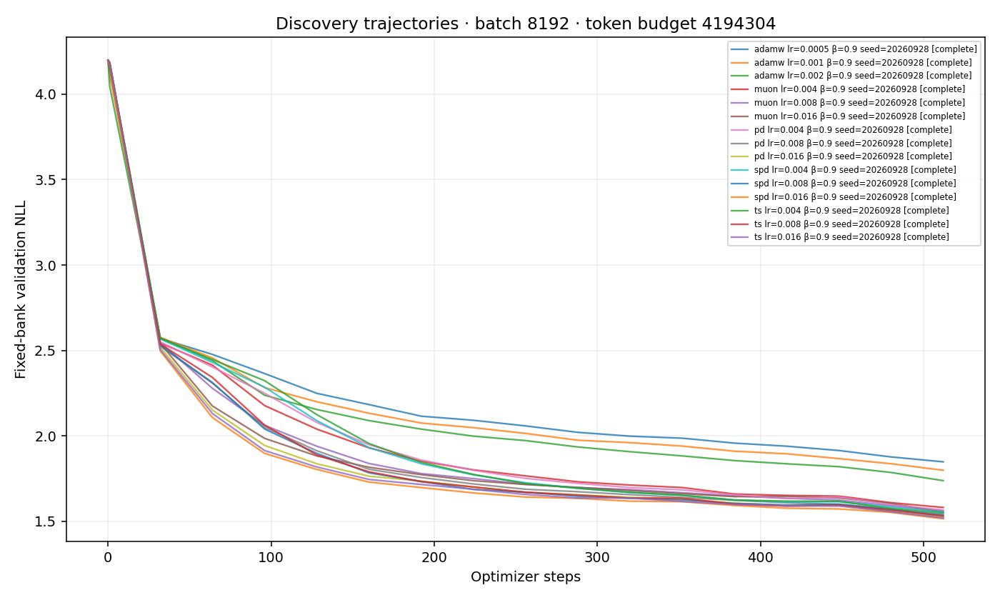

# Tiny surrogate discovery report

Exploratory candidate screening only. Optimizer ordering, batch effects, and momentum optima require fresh-seed confirmation; this report makes no statistical ranking claim.

Accounted for all 15 configured runs: complete=15.
Status is the saved artifact status, not a live scheduler/process check.

Selection uses the mean endpoint fixed validation bank, with the same planned seeds per learning rate. Full-split validation is displayed only after selection. Incomplete grids remain provisional.

| Method | Batch | Momentum | α | Selected LR | Fixed-bank NLL | Full NLL | Seeds | Bracket |
|---|---:|---:|---:|---:|---:|---:|---:|---|
| adamw | 8192 | 0.9 | 0.25 | 0.002 | 1.738028 | 1.748487949371338 | 1 | boundary |
| muon | 8192 | 0.9 | 0.25 | 0.016 | 1.553936 | 1.571211576461792 | 1 | boundary |
| pd | 8192 | 0.9 | 0.25 | 0.016 | 1.521111 | 1.5326248407363892 | 1 | boundary |
| spd | 8192 | 0.9 | 0.25 | 0.016 | 1.514761 | 1.5293382406234741 | 1 | boundary |
| ts | 8192 | 0.9 | 0.25 | 0.016 | 1.519500 | 1.5357614755630493 | 1 | boundary |

See `selection.json` for complete recipes, all candidate scores, and selected run IDs; `runs.csv` includes every configured status and issue.

The pre-cooldown value is the final evaluation at or before the configured cooldown start (90% by default). An overfit sign means validation worsened from that point while the fixed training probe improved; it is a descriptive flag, not a significance test.

Overfit signs: none observed in available paired probe points.

Pairing audit: 0 groups with mismatched hashes; 0 groups with missing hashes. Details and missing run IDs are in `pairing.json`. Hash matching checks initial weights, the training-window stream, the fixed validation bank, corpus bytes, and split manifests within seed/budget/architecture groups.

No common loss thresholds were supplied. No success thresholds or step-equivalent speedups were selected after seeing the trajectories.

