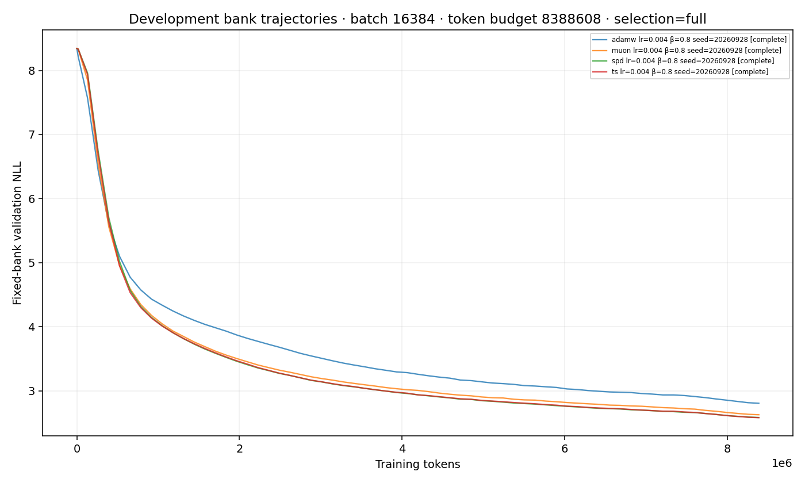
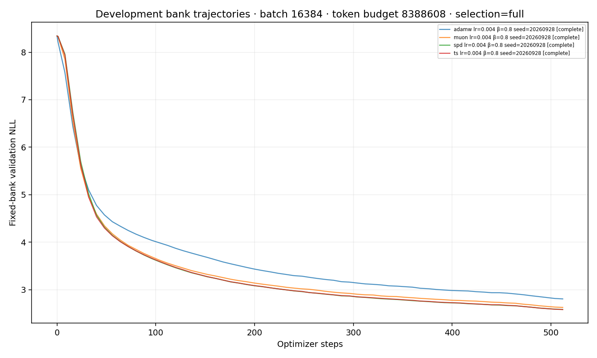

# Tiny surrogate discovery report

Exploratory candidate screening only. Optimizer ordering, batch effects, and momentum optima require fresh-seed confirmation; this report makes no statistical ranking claim.

Accounted for all 4 configured runs: complete=4.
Status is the saved artifact status, not a live scheduler/process check.

Selection uses the declared mean endpoint development metric, with the same planned seeds per learning rate: `selection_metric=bank` (default) selects the fixed bank; `selection_metric=full` selects the full development split. Both scores are retained; incompatible policies form separate groups. These are development scores, not sealed-test results. Incomplete grids remain provisional.

| Method | Batch | Momentum | α | Selection basis | Selected LR | Fixed-bank NLL | Full NLL | Seeds | Bracket |
|---|---:|---:|---:|---|---:|---:|---:|---:|---|
| adamw | 16384 | 0.8 | 0.25 | full | 0.004 | 2.806892 | 2.797844030666325 | 1 | unqualified |
| muon | 16384 | 0.8 | 0.25 | full | 0.004 | 2.628392 | 2.6194193635095644 | 1 | unqualified |
| spd | 16384 | 0.8 | 0.25 | full | 0.004 | 2.585426 | 2.5723604962307367 | 1 | unqualified |
| ts | 16384 | 0.8 | 0.25 | full | 0.004 | 2.583011 | 2.5722920332328814 | 1 | unqualified |

See `selection.json` for complete recipes, all candidate scores, and selected run IDs; `runs.csv` includes every configured status and issue.

The pre-cooldown value is the final evaluation at or before the configured cooldown start (90% by default). An overfit sign means validation worsened from that point while the fixed training probe improved; it is a descriptive flag, not a significance test.

Overfit signs: none observed in available paired probe points.

Pairing audit: 0 groups with mismatched hashes; 0 groups with missing hashes. Details and missing run IDs are in `pairing.json`. Hash matching checks initial weights, the training-window stream, the fixed validation bank, corpus/data identity (tokenized manifest or legacy text hash), and split manifests within seed/budget/architecture groups. Validation-bank length hashes are checked when any peer records them; historical groups that all omit them remain compatible.

No common loss thresholds were supplied. No success thresholds or step-equivalent speedups were selected after seeing the trajectories.

